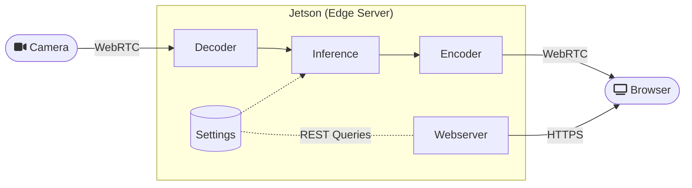

<palign="right"><sup><a href="pytorch-collect-detection-CN.md">返回</a> | <a href="webrtc-html-CN.md">下一步</a> | </sup><a href="../README-CN.md#hello-ai-world"><sup>内容</sup></a>
<br/>
<sup>Web应用程序框架</sup></s></p>


# WebRTC服务器


jetson-inference 包括一个集成的 WebRTC 服务器，用于在 Web 浏览器之间传输低延迟实时视频，可用于构建由 Jetson 和后端 AI 提供支持的动态 Web 应用程序和数据可视化工具。  WebRTC 通过 jetson-utils 的 [`videoSource/videoOutput`](aux-streaming-CN.md#source-code) 接口与 DNN 推理管道无缝协作，该接口通过 GStreamer 利用硬件加速视频编码和解码。  它支持同时向多个客户端发送和接收多个流（无需为每个独立客户端重新编码视频），并包含一个用于远程查看视频流的内置网络服务器前端: 


在这张全双工模式的屏幕截图中，笔记本电脑的网络摄像头通过 WebRTC 传输到 Jetson，Jetson 对其进行解码并使用 detectorNet 执行目标检测，然后重新编码输出并通过 WebRTC 再次将其发送回浏览器进行播放。  从本地无线网络交互的角度来看，往返延迟基本上不会被注意到。  在客户端，它已经使用 H.264 压缩在多种浏览器上进行了测试，包括 Chrome/Chromium、移动 Android 和移动 iOS (Safari)。





任何使用 videoSource/videoOutput 的应用程序（包括此存储库中的 [C++/Python 示例](../README-CN.md#code-examples)）都可以通过使用 `webrtc://@:8554/my_stream` 或类似的流 URL 启动它们来轻松启用此 WebRTC 服务器。  提供了更多示例，这些示例构建在这些组件的基础上，并通过更复杂的处理管道和带有交互式控件的 Web UI 实现可定制的前端。


## 启用 HTTPS/SSL


建议使用安全的 HTTPS 和 SSL/TLS 来传输 WebRTC 流并提供网页服务，以便对其进行加密。  此外，浏览器需要 HTTPS 才能从 PC 使用客户端的网络摄像头。  要启用 HTTPS，首先需要生成自签名 SSL 证书和密钥: 


``` bash
$ cd /jetson-inference/data
$ openssl req -x509 -newkey rsa:4096 -keyout key.pem -out cert.pem -sha256 -days 365 -nodes -subj '/CN=localhost'
$ export SSL_KEY=/jetson-inference/data/key.pem
$ export SSL_CERT=/jetson-inference/data/cert.pem
```


当您设置 `$SSL_KEY` 和 `$SSL_CERT` 环境变量时，应用程序将自动从此存储库中获取它们，并且将启用 HTTPS。  否则，您将需要在启动时设置 `--ssl-key` 和 `--ssl-cert` 命令行参数。


您还可以将这些证书存储在 `/jetson-inference/data` 的 leui 中的任何位置 - 尽管如果您使用的是 Docker 容器，建议使用该路径，因为它会安装到主机，因此您的证书将在退出容器后保留。


当您第一次将浏览器导航到使用这些自签名证书的页面时，它会向您发出警告，因为它们不是来自受信任的机构: 


您可以选择覆盖此设置，并且在您更改证书或设备的主机名/IP 更改之前，它不会再次出现。


## 发送 WebRTC 流


要通过 WebRTC 将任何[支持的视频流](aux-streaming-CN.md#input-streams) 发送到浏览器进行播放，只需将 videoOutput URL 设置为 `webrtc://<INTERFACE>:<PORT>/<STREAM-NAME>` 即可。  指定 `0.0.0.0` 或 `@` 作为接口将绑定到设备上的所有网络接口。  使用的端口通常为 8554，但您可以根据需要更改它。  每个视频源的流名称应该是唯一的（您可以随意命名它们，但它们不应包含斜杠），因为这些唯一名称允许同一 WebRTC 服务器实例同时路由多个流，并用作 websocket 的路径。


``` bash
$ video-viewer /dev/video0 webrtc://@:8554/output  # stream V4L2 camera to browsers via WebRTC
$ detectnet.py csi://0 webrtc://@:8554/output      # stream MIPI CSI camera, with object detection
```


然后，您应该能够将浏览器导航到 `https://<JETSON-IP>:8554` 并查看视频流，如上图所示。  各种连接统计信息在页面上动态更新，例如比特率以及接收/丢弃的帧和数据包的数量。  有时，打开浏览器的调试控制台日志（Chrome 中的 `Ctrl+Shift+I`）会很有帮助，因为有关 WebRTC 连接状态的状态消息会在其中打印出来。


### 视频输出代码


如果您在程序中使用 videoOutput 接口并希望对其进行硬编码以用于流式 WebRTC（而不是解析命令行），您可以像这样创建它: 


```` 蟒蛇
# Python
输出 = jetson_utils.videoOutput("webrtc://@:8554/output")


# C++
videoOutput* 输出 = videoOutput::Create("webrtc://@:8554/output");
````


然后，您可以在主循环中使用 videoOutput 接口来渲染帧，就像以前在这些[示例](aux-streaming-CN.md#source-code)中一样。


## 接收WebRTC流


您还可以通过 WebRTC 从浏览器网络摄像头接收流。  为此，请启用 HTTPS 并设置 videoInput URL，与上面类似: 


``` bash
$ video-viewer webrtc://@:8554/input my_video.mp4  # save browser webcam to MP4 file
$ imagenet.py webrtc://@:8554/input my_video.mp4   # save browser webcam to MP4 file (applying classification)
```


> **注意**: 接收浏览器网络摄像头需要启用 [HTTPS/SSL](#enabling-https--ssl)


然后再次将浏览器导航到 `https://<JETSON-IP>:8554`，系统将提示您启用对摄像头设备的访问，并且流式传输将开始。  在此之前，Jetson 的终端中将会打印有关视频捕获超时的警告消息 - 这些是正常现象，可以忽略，因为提供流的客户端尚未连接。


### 视频源代码


如果您在程序中使用 videoSource 接口并希望对其进行硬编码以接收 WebRTC（而不是解析命令行），您可以像这样创建它: 


```` 蟒蛇
# Python
输入 = jetson_utils.videoInput("webrtc://@:8554/input")


# C++
videoSource* 输入 = videoInput::Create("webrtc://@:8554/input");
````


然后，您可以在主循环中使用 videoSource 接口来捕获视频，就像以前在这些[示例](aux-streaming-CN.md#source-code) 中那样。


## 全双工


要模拟发送和接收 WebRTC 流，只需为输入和输出位置指定 `webrtc://` 协议: 


``` bash
$ video-viewer webrtc://@:8554/input webrtc://@:8554/output  # browser->Jetson->browser loopback
$ posenet.py webrtc://@:8554/input webrtc://@:8554/output    # loopback with pose estimation
```


然后，当您导航到该页面时，它会从浏览器的网络摄像头发送视频并播放结果。  后续示例将展示如何制作您自己的后端 AI 服务器应用程序以及使用不同 Web 框架构建的前端。


<palign="right">下一个| <b><a href="webrtc-html-CN.md">HTML / JavaScript</a></b></p>
</b><palign="center"><sup>© 2016-2023 NVIDIA | </sup><a href="../README-CN.md#hello-ai-world"><sup>目录</sup></a></p>